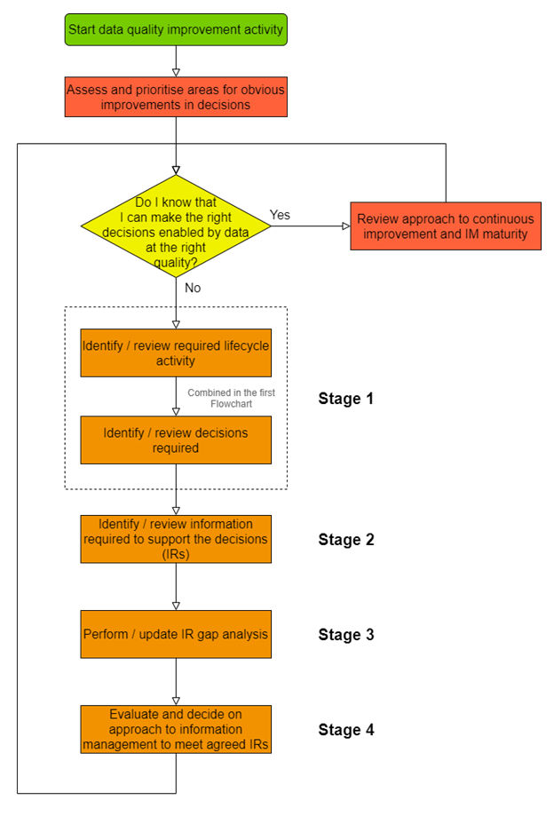
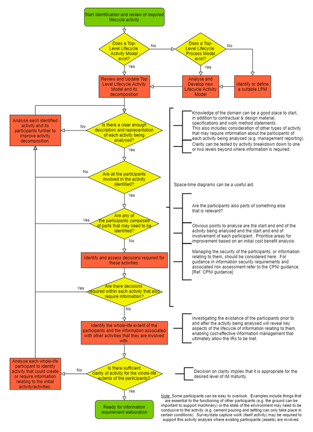
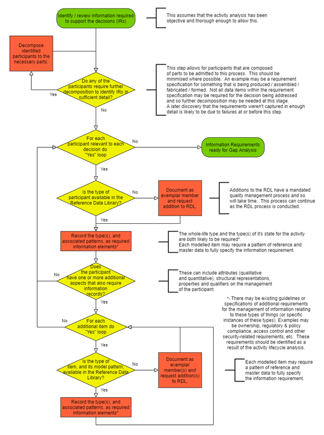
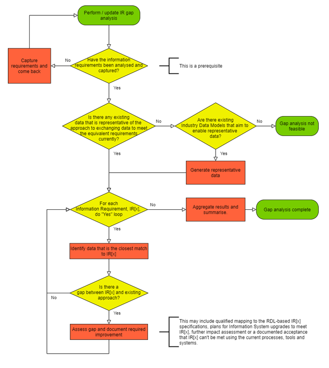
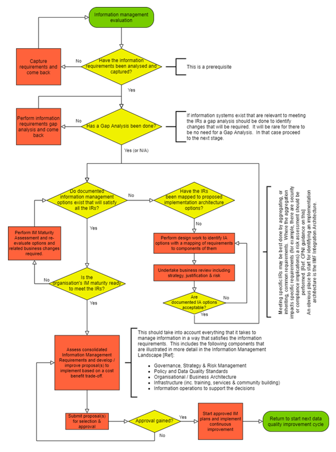

# A methodology for meeting information requirements
_A systematic approach to identifying information requirements and subsequently meeting them throughout any activity lifecycle_

> This document is a working draft for comments and use

## Introduction and Purpose
Addressing data quality to ensure that it is fit for purpose requires an organised approach to working out what information is needed and how that information is to be managed.  This document introduces a structured, methodical approach to identifying what information is needed to support any activity lifecycle; large or small.  The methodology is part of an integrated approach to information management [[1]](#references), and is compatible with the adoption of other necessary components of integrated data.

## Introducing a method based on continuous improvement
A mature approach to information management ensures that data is at the right quality to support the required decisions [[2]](#references). Achieving this and maintaining it requires an approach of continuous improvement to data quality.  It is also beneficial to build up to a high level of maturity progressively and, while the methodology (this term is used as it aims to be a complete “system of methods” for the activity of managing information to the required quality) can look daunting before it is used, it can be useful to have an integrated view of a continuously applicable method for any application.  It is broken down into four stages. This methodology, presented as a set of flowcharts, covers a general approach to identify and then meet the information requirements in any context that needs data at the required quality. While this document introduces a comprehensive method, it is predicated on organisations having reached a point of recognition that there is a need to address data quality in a way that enables improved decisions within their organisation and with those they have data-based relationships with.  The scope of its application and the degree to which each stage (and each part of each stage) is followed will depend on the adopter’s information management maturity at the time of use and the ambition to improve at each iteration of application.  The method in Figure 1 is based on iterations of the following four stages, with an initial point of entry into it as a result of a decision to commit to data quality within an organisation, department or group.  

## Embark on Data Quality Improvement

Assess and prioritise areas for data quality improvement.  Try to set an ambitious but achievable goal in the first iteration, accepting that getting it right first time may be challenging.  Ideally gain sufficient senior support for doing this from the outset.

# Stage Overview

### Stage 1 - Identify Lifecycle Activities and Decisions Required
Identify and describe activities through process modelling techniques [[2]](#references) to document the activities, their participants and the decisions required.

### Stage 2 - Identify Information Requirements that Support the Decisions
Analyse the decisions and identify information needed to support them. 

### Stage 3 - Conduct Information Requirements Gap Analysis
Assess the difference between any information that is currently used and the identified requirements.

### Stage 4 - Evaluate and Decide on Approach to Information Management
Investigate the approach to implementing information systems and other aspects of information management to meet the requirements.  Reach agreement on what is to be done on a cost-benefit basis.

### Return to assess further improvements to data quality in support of decisions
Review what went well and what remains to be improved.  Embark on Stage 1 with ambition for the next iteration.  If the required quality has been achieved, it is time to increase the scope.

The methodology is intended to be self-explanatory, but its application will require reference to other materials published by the referenced authors and the UK Information Management Framework as it progresses.  Some anticipated Frequently Asked Questions are provide at the end as guidance.
It is recommended that prior to its first use there is an understanding of the organisation’s current level of information management maturity and an agreement for some initial priority areas to adopt the methodology. It can also be useful to seek advice on how deeply to apply each step on first use.  Once bootstrapped this methodology should directly support increasing levels of information management maturity in the areas that adopt it and accommodate the increase in scope of its application within and between organisations.

*Figure 1 - Overall methodology for meeting Information Requirements through continuous data quality improvement*

# The Stages

## Stage 1: Identify Lifecycle Activities and Decisions Required
This Stage is where the analysis of the intended activities within the scope of the selected data quality improvement starts.  It is a flow chart based on the Lifecycle Activity and Process Modelling introduced by Cook [[2]](#references).  By establishing a lifecycle view of the activities being analysed it reveals anything that needs to be involved, or considered, in those activities and the lifecycle of information relating to each participating element of the activity. Conducting this Stage rigorously sets the basis for addressing data quality in the subsequent Stages.  Compromising quality here will compromise the quality of the entire methodology.  The first time this Stage is conducted within a particular scope of data quality improvement there may be limited input material or a “No” to each diamond-shaped decision block in the Flowcharts.  However, once started the material created should not just support the next steps in each flowchart but also provide the input material for the next iteration of the quality improvement cycle.
The flowchart in Figure 2 follows this general pattern:

-	Adopt or develop a Top-Level activity lifecycle model
If this doesn’t exist then one can be developed by building on industry or organisational Lifecycle Process Models (LPMs) or from a clean analysis of the lifecycle of activities that are in-scope for the current data quality improvement cycle [[2]](#references). LPMs can help with re-use ensuring that a common approach is adopted across and between organisations.  Once familiar with the methodology each organisation should seek to use it to develop a Top Level Activity Model as it is this that allows the particular needs of the organisation to be analysed to the required quality.
-	Through analysis develop an activity decomposition that identifies decisions
As information is intended to support decisions this step is vital in identifying the decisions that the activities depend on and the participants are directly relevant to the decisions.  If there are no decisions, there is no need for information.  In order to identify the necessary (or possible) participants in each activity an iterative approach to decomposing each top-level activity must be done.  This can, unsurprisingly, turn out to be a lot of activities and participants, each of which may be composed of many other activities and participants (including parts of already identified participants).
Involving experts and others familiar with the current ways of doing these sorts of activities can be vital and can keep the analysis well-informed. Allow those involved to suggest opportunities for improvement to current practices, suggest ideas and ensure that there is support for any subsequent changes.  Considerations of those involved in supporting activities should be involved [[2]](#references), such as management, procurement, and security (all aspects of security, including information security).
-	Identify the lifecycle-extent of each participant. Each participant can have an existence that extends well beyond (before and after) the activities of interest [[2]](#references).  It is in this broader context that much of the information required is created and, at times, needed to support other activities.  The lifecycle view of each participant has been called a “whole-life” extent but for the purposes of this analysis this is just the period of existence that is relevant to the portfolio of activities that are being analysed during this iteration of the quality improvement cycle.

Once there is sufficient clarity on all the decisions and participants involved in the activities that are in-scope then the Stage is complete for this quality improvement cycle and the Information Requirement capture can now take place in Stage 2.

*Figure 2 – Stage 1, Identify Lifecycle Activities and Decisions Required*

## Stage 2: Identify Information Requirements
The steps involved in documenting the information requirements (IRs) for all identified decisions in Stage 1 follows naturally but may be done by different individuals, teams or even organisations on large data quality improvement programmes.  The quality of work done in Stage 1 will determine the ease at which this Stage progresses.  In a maturity sense it should be expected that there will be unfamiliar steps to it the first time it is done but subsequent iterations should become easier.  In addition, it is recommended that a mature Reference Data Library is used to provide the Reference Data (and, where applicable Master Data. The term “Master Data” is not used in the flowchart as it is just data.  Any data that is considered “Master” across activities, organisations or sectors is just data that there is a wider requirement for.  If it is required to support decisions in the in-scope activities, it will be identified and will just require Reference Data to ensure that it is consistently represented using the flow chart as shown.) for the articulation of the requirements in a consistent manner.
The flowchart in Figure 3 follows this general pattern:
-	Check that there is sufficient decomposition of the participants to conduct the requirements elaboration.  Although this is the goal of the previous Stage it is worth checking that the information required for this Stage is of sufficient quality.  This check can be done by those due to carry out the requirements elaboration, for both familiarisation and quality checking.
-	For each participant relevant to each decision do the following (ideally starting at the lowest level of decomposition, to enable easier aggregation at higher levels.  The pattern is similar to the chart [here](https://en.wikipedia.org/wiki/BORO) and in High Quality Data Models, by M. West.):
    -	Identify the type of each participant.  This should be done by consulting the available RDL(s) that have been developed using this methodology (perhaps for other application areas or in previous iterations of the activity lifecycle in question).  Only Reference Data that is based on an agreed Top Level Ontology(TLO) should be allowed.  Where no suitable Reference Data Classes exist in the Libraries a request should be prepared for the Class(es) to be added.  The benefit of doing this is that there is wider benefit to the information management community, quality management of the Reference Data Library (RDL) and trusted re-use.  The Information Architecture does not require all Reference Data to be held and served centrally but the wider it is made available the greater the lifetime benefit to the organisations making use of it.  The activities, and the arrangement of participants involved, can also be modelled at this stage. 

    -	Once the type(s) of the participant have been identified then the other aspects of the participant, the information required about it, should be identified and addressed through a similar process.  This includes qualitative and quantitative properties as well as qualifiers on the management of the information relating to the participant.  This can include compliance needs, security controls, ownership information, timeliness needs, accuracy required, provenance records, etc.  In early iterations of this methodology there may be limited capability (in the adopting organisations and in the features available in the available RDL) to elaborate all the requirements using the RDL(s) alone.  However, this is (in the limit) the goal for an enduring and mature use of an Information Management Framework (IMF). The aim of the TLO is to enable any, and all, information requirements to be accommodated formally and consistently.  This will take time to achieve but the quality management approach, based on information management maturity, shouldn’t be limited by this progressive approach to availability of RDL classes and class patterns as the use of the IMF grows.

*Figure 3 - Stage 2, Identify Information Requirements that Support the Decisions*

##	Stage 3: Conduct IR Gap Analysis
This Stage is perhaps the most important one to undertake.  It essentially provides the information required to make decisions, in Stage 4, about how the IRs (requirements for data at least at the quality documented during Stage 2) are going to be met with the available resources.  While the subsequent Stage may involve prioritisation and an acceptance that not all the requirements can be met it is easier to make plans for further improvements if there is a record of what gaps were identified.  Re-use is an ongoing theme of good quality management and the use of a suitable IMF encourages a maximal level of re-use of Reference Data and, between permitted organisations, the data that is created and managed based on it.
The flowchart shown in Figure 4 adopts a similar method to the previous Stages:
-	An initial check on the quality of the input Information Requirements is vital.  As with Stage 2 this is both to ensure that those conducting this activity are familiar with the outputs of Stage 2 and to carry out a quality check to identify issues before the Stage progresses.
-	Seek exemplar data that is in use currently (or indicative of in-use data) that is intended to support the identified decisions.  This is the first point at which existing data is used.  This ensures that the analysis is done objectively without seeking to accommodate any current practices that may compromise the requirements or the decisions about what information systems and management practices are decided upon in Stage 4.  Where there is an absence of available in-use data then models that are typically used or enable representative data to be created should be used. This can often turn out to be a step of Stage 3 that requires trust between the information producer/owner and those conducting the Gap Analysis.  However, it is in no party’s interest for the gap analysis to be compromised by lack of, or unrepresentative, data.  Quality improvement needs trusted interaction.  If there isn’t a basis for trusted Gap Analysis it may be better to stop and revisit the commitment to quality improvement set at the start and any issues of trust (including protection and management of the supplied data) that may have developed.
-	From this point the Gap Analysis can proceed methodically, going through the identified IRs and comparing the existing data quality with them.  Any gaps identified should be documented clearly, perhaps with references to dependencies or improvements needed to existing approaches.  The activity may also consider where there is partial alignment with the RDL-based requirements and the potential for a mapping from existing data systems to an IMF-compliant system.
-	A final step should be the aggregation of the gap analysis and a summary of any general themes, priority areas to address and any recommendations that are relevant to Step 4.

*Figure 4 -  Stage 3, Conduct Information Requirements Gap Analysis*

##	Stage 4: Evaluate and Decide Approach to Information Management
It is only at this Stage that consideration needs to be given to the practical aspects of managing information to meet the requirements.  Objectivity required in the earlier Stages can easily be compromised if existing or already “preferred” approaches to future information storage, processing and handling are involved too early.  As with the earlier Stages it is also likely that the individuals and organisations involved in this Stage may be largely different from the previous Stages (Pragmatic oversight by the organisation commissioning the data quality-based approach to information requirements is assumed as a minimum level of continuity.  In larger programmes it is likely that quality management, systems engineering, design authorities and business sponsors, etc will be involved throughout.).  Serious business decisions, investment cases, risk management, architectural choices and related decisions may be required at this Stage.  By following this methodology judgement can be applied to the degree of change that can be accommodated with a developed knowledge of the commitment required to follow through with any proposed changes or the consequences of not meeting the requirements if the commitments aren’t made (as with any cost-benefit trade-off).
The flowchart shown in Figure 5 has this outline pattern:
-	Check that the inputs from the previous stages have been done suitably (where applicable).  Again, this ensures that those conducting this Stage are familiar with the work done prior to it and that the quality is checked.  If a Gap Analysis hasn’t been done there needs to be a very good reason for it not being done (e.g. a clean-sheet development of something new).
-	Information management (IM) option development to meet requirements:
    - If implementation options don’t exist, then they need to be developed by a suitable assessment of the Information Requirements (IRs) that are mapped to one or more implementation architecture (IA) options.  These options need to be documented such that their alignment to the business is quantified and can be justified.  This may need some revision and, depending on the scale and complexity of the intended use, may need some specialist systems architecture and information systems skills that are aware of the approach to address data quality consistently within and between the systems involved.  Any impacts of the design choices to meeting the information requirements should be documented and any risk-based choices also recorded.
    -	When options that can meet the IRs have been developed (or have known compromises that may be deemed acceptable) then is then worth checking the organisation has sufficient maturity to adopt them.  Having entered the methodology with a recognition that continuous data quality improvement is needed this step should ensure that the IM options proposed to the organisation for consideration are ambitious but also achievable. 
-	The final stage is to develop the business case for the options developed and address the wider business considerations (and commitments) that are needed for them to succeed.  This may result in some iterations to align the information management improvements with other business cycles but the cost and benefit of doing this will be clear if the Stages have been executed clearly.  For the range of considerations that are likely to be within scope for an organisation that has achieved a high level of information management maturity please refer to West [[3]](#references); two pending publications that analyse the current information management landscape and another of how to achieve this level of information management maturity.

*Figure 5 – Stage 4, Evaluate and Decide on Approach to Information Management*

#	References
1. West, Matthew. Developing High Quality Data Models, 1st Edition. s.l. : Morgan Kaufmann, 2010. ISBN: 9780123751072. [Link](https://www.elsevier.com/books/developing-high-quality-data-models/west/978-0-12-375106-5)
2. Cook, A. An integrated approach to information management. 2021. [Link](https://www.cdbb.cam.ac.uk/what-we-do/national-digital-twin-programme/resource-integrated-approach-information-management)
3. West, Matthew. Managing Shared Data (Pending publication). 2022.

# Further Reading
1. ISO/TC184/SC4. Industrial automation systems and integration — Integration of life-cycle data for process plants including oil and gas production facilities — Part 13: Integrated asset planning life-cycle. ISO/DIS 15926-13. [Link](https://www.iso.org/standard/70694.html)
2. INCOSE, IEEE Systems Council, Stevens Institute of Technology. Guide to the Systems Engineering Body of Knowledge (SEBoK), V2.2. 2020. [Link](https://sebokwiki.org/w/images/sebokwiki-farm!w/6/66/SEBoK_v_2.6_20220520.pdf)
3. INCOSE. Integrated Data as a Foundation of Systems Engineering. 2018. [Link](https://www.omgwiki.org/MBSE/lib/exe/fetch.php?media=mbse:rwg_data_as_a_foundation_of_se_draft_5_050218_review_copy.pdf)
